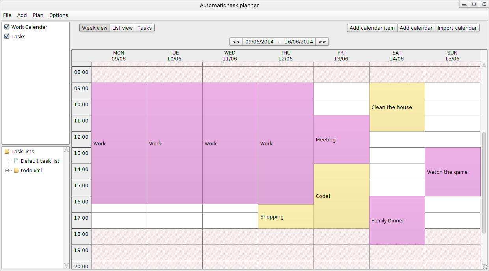

Plnr
=========

**Plnr** plans your tasks automatically and intelligently in your own calendar.

Why
----------
Time is scarce. Making a planning for your responsibilities, tasks and deadlines takes effort. You will have more free time letting this software do the work. 
**Plnr** is designed to provide you with an organized and intelligent planning in a fast and easy manner. 
Furthermore the software can be used like any other calendar application.

Functionality
----------
- Loading and saving calendars in ICal format and tasks in a custom XML format.

- Good looking GUI that is easy to use.
    * Weekview, Listview and Taskview
    * Drag and drop of calendaritems in the WeekView

- Planning without conflicts avoiding calendaritems from multiple calendars.

- Generating a planning as soon as possible, as late as possible or as spread out as much as possible.

- The planning respects the deadline, duration and priority of tasks.

- Various settings
    * Multiple languages (English and Dutch for now)
    * Multiple timezones supported
    * Plannable during weekends option
    * Daily plannable period selection (E.g. from 9:00 to 17:00)
    * Weekly unplannable periods (E.g. every weekday from 11:30 to 12:00)

Installation
----------
You need the Java 8 JRE to run Plnr. You can download it [here](http://www.oracle.com/technetwork/java/javase/downloads/jre8-downloads-2133155.html).
Download the application [here](./releases/plnr.jar) and doubleclick the file to run it.

Roadmap
----------
If you want to see a new feature, please send a feature request at the [issues section](https://github.com/MartijnTheunissen/PLNR/issues).
We have quite some new features planned. Here are a few ideas:

- Tasks that are able to split over multiple periods.
- Month or year view
- Undo and redo support.
- Categorizing tasks
- Show conflicting calendar items and provide ways to solve them
- Support for other languages (French, German, ...)
- More planning algorithms.
- Repeating tasks

Feedback
-----------
If you found a bug, please report it at the [issues section](https://github.com/MartijnTheunissen/PLNR/issues). We appreciate these a lot! 
If you like to discuss other things, feel free to send me a message or email me at martijn.theunissen@student.uhasselt.be

Compilation
-----------
You will need the Java 8 JDK. You can download it [here](http://www.oracle.com/technetwork/java/javase/downloads/jdk8-downloads-2133151.html).
Open the source files in your favorite editor. You will need to add all the jars under the /lib/ folder to your classpath.

Special thanks
-----------
 This software started as a project for 'Project Software ontwikkeling en professionele vaardigheden' by UHasselt University Belgium. ( www.uhasselt.be )  
 We also thank Androme ( www.androme.com )
